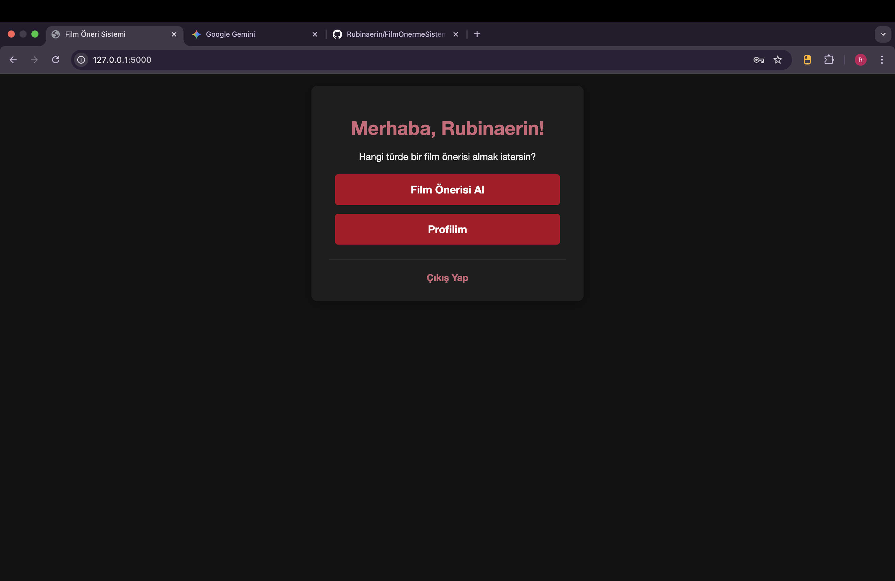
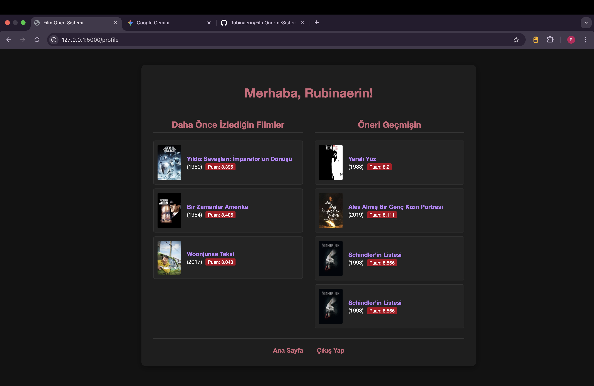

# 🎬 Film Önerme Sistemi (Dark Theme)

Bu proje, **Python** ve **Flask** web çatısı kullanılarak geliştirilmiş, kullanıcılara özelleştirilmiş film önerileri sunan ve izleme geçmişlerini tutan dinamik bir web uygulamasıdır. Veritabanı yönetiminde **Microsoft SQL Server** kullanılmıştır.

---

## ✨ Ana Özellikler

* **Kullanıcı Kimlik Doğrulama:** Güvenli kayıt, giriş ve oturum yönetimi.
* **Özelleştirilmiş Öneri:** Kullanıcının seçtiği film türüne göre öneri yapabilme.
* **İzleme Takibi:** Kullanıcının beğendiği veya daha önce izlediği filmleri profilinde takip etme.
* **Modern Koyu Tema:** Kırmızı vurgularla minimalist ve dikkat çekici bir kullanıcı arayüzü (UI) tasarımı.

---

## 🛠️ Teknolojiler

| Kategori | Teknoloji | Açıklama |
| :--- | :--- | :--- |
| **Backend** | Python (Flask) | Uygulama mantığı ve rotalama için hafif web çatısı. |
| **Veritabanı**| MS SQL Server | Kalıcı veri depolama ve verimli sorgulama için kullanılmıştır. |
| **Frontend** | HTML5, CSS3 | Duyarlı ve modern dark theme tasarımı. |
| **Diğer** | Jinja2 | HTML şablonlama motoru. |

---

## 📸 Uygulama Ekran Görüntüleri (Screenshots)

### 1. Giriş ve Kayıt Sayfası

Uygulamanın şık koyu temalı giriş ve kayıt formları.

| Giriş Yap | Kayıt Ol |
| :---: | :---: |
|  |  |

> **NOT:** Lütfen buradaki görüntü adlarını kendi yüklediğiniz dosyalarla eşleştirin (Örn: `Ekran Resmi 2025-09-29 17.24.32.png` -> `assets/giris_sayfasi.png`).
> * **Giriş Yap:** `giris_sayfasi.png`
> * **Kayıt Ol:** `kayit_sayfasi.png`

### 2. Ana Sayfa ve Tür Seçimi

Giriş yapan kullanıcıyı karşılayan ve film türü seçimini sağlayan arayüz.

| Ana Sayfa (Hoş Geldiniz) | Kategori Seçimi |
| :---: | :---: |
|  |  |

> * **Ana Sayfa:** `ana_sayfa.png`
> * **Kategori Seçimi:** `kategori_secme_sayfasi.png`

### 3. Film Önerisi ve Detay

Seçilen türe göre sunulan film önerisi ekranı.


> * **Film Önerisi:** `oneri_sayfasi.png`

### 4. Profil Sayfası

Kullanıcının **Daha Önce İzlediği Filmler** ve **Öneri Geçmişinin** görüntülendiği ekran.



> * **Profil Sayfası:** `profil_sayfasi.png`

---

## ⚙️ Kurulum ve Başlatma

Projeyi yerel makinenizde çalıştırmak için aşağıdaki adımları izleyin:

1.  **Gereksinimleri Yükleyin:** Python ve Flask kütüphanesinin kurulu olduğundan emin olun.
2.  **Veritabanı Kurulumu:**
    * MS SQL Server'da `FilmOnermeSistemi` adında bir veritabanı oluşturun.
    * Gerekli tabloları (`Filmler`, `Kullanicilar`, `KullaniciIzlemeGecmisi`, `KullaniciOneriGecmisi`) oluşturun ve `veri_cek.py` ile veri eklemeyi sağlayın.
3.  **Uygulamayı Başlatma:** Proje dizininde (app.py dosyasının bulunduğu yerde) terminali açın ve uygulamayı başlatın:
    ```bash
    python app.py
    ```
4.  **Erişim:** Tarayıcınızı açın ve `http://127.0.0.1:5000` adresine gidin.
